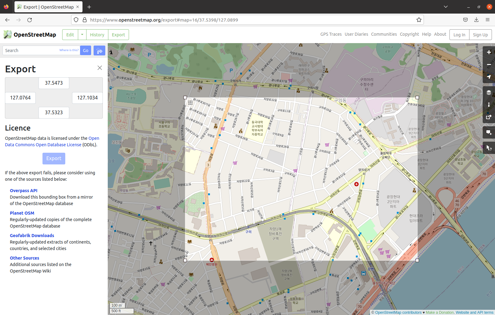

# Sumo Lab

## Installation

### Debian/Ubuntu

There are available sumo packages from the official ubuntu repository

```bash
sudo apt install sumo sumo-tools
```

## Simulation using openstreetmap

- Open [OpenStreetMap Export](https://www.openstreetmap.org/export)

 

- Download then save into your directory
- Open the terminal and run the following command to convert openstreetmap into netedit format

```bash
netconvert --osm-files map.osm -o map.net.xml
```

- Generate the trips using `randomTrips.py` tools, please run the following command.

```bash
/usr/share/sumo/tools/randomTrips.py -n map.net.xml -r map.rou.xml -o map.trips.xml -e 100 -p 0.5
```

## Generate sumocfg using GUI

- From your terminal, run

```bash
netedit map.net.xml
```

- In the netedit application, please find **File**-> **Demands Elements** -> **Load Demands Elements** (Ctrl + D)

- Load your route file (e.g map.rou.xml)

- Save the demands **File** -> **Demands Elements** -> **Save Demands Elements**, then press Ctrl + T to run the simulation using sumo-gui

- Adjust the delay in the simulation

- Press the Play button (the green button)

- Save the simulation sumocfg **File** -> **Save Configuration** (Ctrl + Shift + S)

## Generate sumocfg using XML config directly (Alternate way)

- Create config below

```xml
<configuration>
  <input>
    <net-file value="map.net.xml"/>
    <route-files value="map.rou.xml"/>
  </input>
</configuration>
```

## Generate trace file and tcl

- Generate trace file using the following command

```bash
sumo -c map.sumocfg --fcd-output trace.xml
```

- Generate mobility output as tcl file format using the following command

```bash
/usr/share/sumo/tools/traceExporter.py --fcd-input trace.xml --ns2mobility-output ns2mobility.tcl
```

## Integrate into NS3

- Copy all code from the `src/scratch/sumo` into your `<ns3-home>/scratch/sumo`

- Put the `ns2mobility.tcl` into your `<ns3-home>/scratch/sumo`

- Run the ns3 simulation using the following command

```bash
./waf --run scratch/sumo/sumo --vis
```
