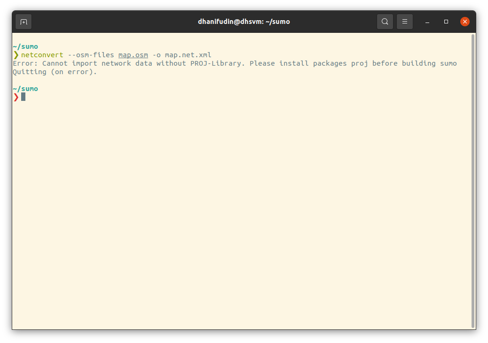
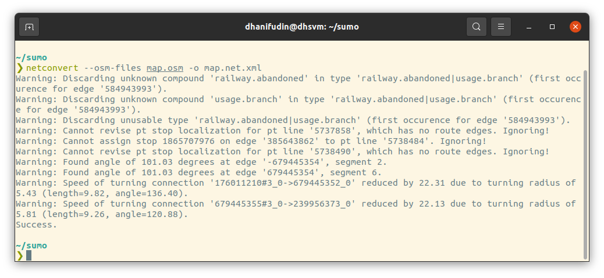
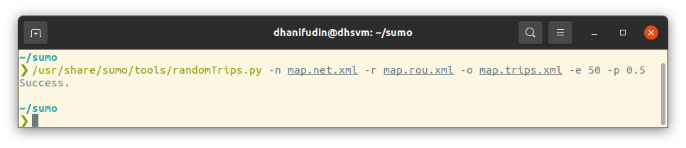
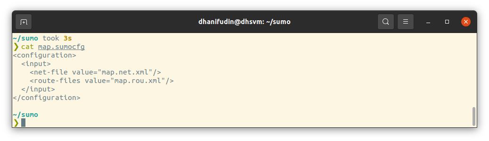
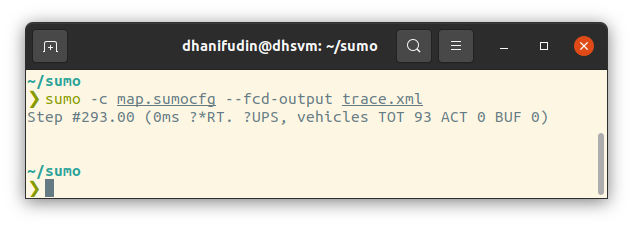
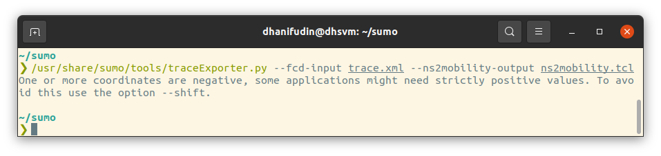

# NS3, SUMO Homework

## 1. SUMO Installation

- Sumo package is available from the official ubuntu repository. We can simply install using following command

```bash
sudo apt install sumo sumo-tools
```



## 2. OpenStreetMap












## 3. Custom Map
