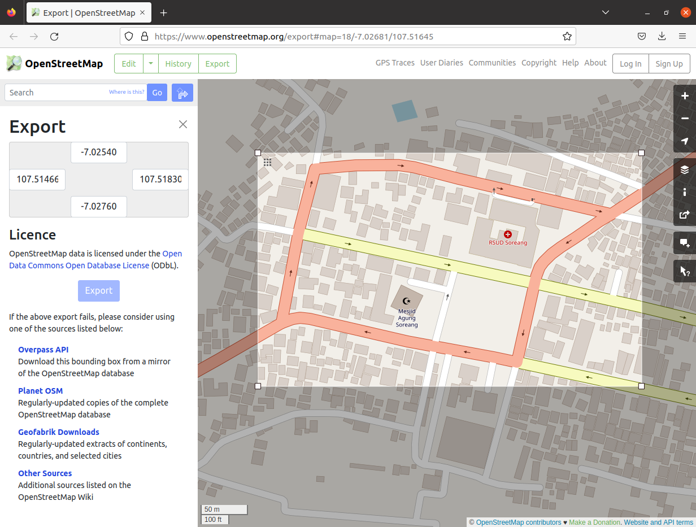

# NS3, SUMO Homework

Name: Dian Hanifudin Subhi

Student ID: C2493106

## 1. SUMO Installation

- The `sumo` package is available from the official Ubuntu repository. We can simply install using the following command

```bash
sudo apt install sumo sumo-tools
```

> Unfortunately `sumo` from the official Ubuntu repository has a bug when converting the osm map into netedit format.
> 

- Ubuntu provides PPA to help install the `sumo` package. Add the PPA repository
  using following command.

```bash
sudo add-apt-repository ppa:sumo/stable
sudo apt update
```

- Upgrade the previous sumo, using the following command.


## 2. OpenStreetMap

- Open the OpenStreetMap at [https://openstreetmap.org/export](https://openstreetmap.org/export). Select area, then
press **Export** button to export the area. Save the file as `map.osm`.

  

- Convert the map from openstreetmap into netedit format using the following
  command.

  ```bash
  netconvert --osm-files map.osm -o map.net.xml
  ```

  

- Generate the trips using `randomTrips.py` sumo tools. Please run the following
  command.

  ```bash
  /usr/share/sumo/tools/randomTrips.py -n map.net.xml \
    -r map.rou.xml -o map.trips.xml -e 50 -p 0.5
  ```

  

- Create `map.sumocfg` configuration, the file consists of location net and route
  file.

  


- Generate the trace file using the following command.

  ```bash
  sumo -c map.sumocfg --fcd-output trace.xml
  ```

  

- Generate the tcl file using `traceExporter.py` from sumo tools. Please run
  the following command below.

  ```bash
  /usr/share/sumo/tools/traceExporter.py --fcd-input trace.xml \
    --ns2mobility-output ns2mobility.tcl
  ```

  

- Integrate the tcl file into NS3 project using `N2MobilityHelper`. create new directory
  inside the scratch folder `<ns3-home>/scratch/ns3-sumo`. Then, copy the example project from
  `<ns3-home>/examples/routing/manet-routing-compare.cc` into
  `<ns3-home>/scratch/ns3-sumo/scratch-sumo.cc`. Copy the `ns2mobility.tcl` file
  into `<ns3-home>/scratch/ns3-sumo/` directory.

- We need to count the size of nodes from tcl file. We can use
  `ns2-node-utility.h` provided by https://github.com/addola/NS3-HelperScripts to get the size of nodes automatically
  using the `GetNNodes()` method. Copy the header and implementation file into
  `<ns3-home>/scratch/ns3-sumo`. Add include statement in `scratch-sumo.cc`.

  ```cc
  #include "ns2-node-utility.h"
  ```

- Add attributes below into the `scratch-sumo.cc`

  ```cc
  private:
    inline static const std::string traceFile = "scratch/ns3-sumo/ns3mobility.tcl";
    Ns2NodeUtility utility;
    uint32_t nnodes;
    double simulationTime;
  ```

- Modify the `RoutingEnvironment::Run` method implementation to load tcl file.
  The code below

- Run the simulation using the following command. The simulation run using the AODV protocol by default.

```bash
./waf --run scratch/ns3-sumo/ns3-sumo --vis
```

  

- Repeat the simulation using another protocol by changing the protocol flag.

  | Protocol | Value |
  | ---      | ---   |
  | OLSR     | 1     |
  | AODV     | 2     |
  | DSDV     | 3     |
  | DSR      | 4     |

> We can configure no mobility by adjust the logic below
> ```cc
> int nodeSpeed = 0;
> ```

- To speed up the simulation, we can skip visualization and check the result of
  the simulation inside `manet-routing-compare.csv` file.

## Result of Simulation

### AODV with Mobility

| SimulationSecond | ReceiveRate | PacketsReceived | NumberOfSinks | RoutingProtocol | TransmissionPower |
| ---              | ---         | ---             | ---           | ---             | ---               |
| 102              | 1.024       | 2               | 10            | AODV            | 7.5               |
| 103              | 2.048       | 4               | 10            | AODV            | 7.5               |
| 104              | 2.048       | 4               | 10            | AODV            | 7.5               |
| 105              | 2.048       | 4               | 10            | AODV            | 7.5               |
| 106              | 2.048       | 4               | 10            | AODV            | 7.5               |
| 107              | 1.536       | 3               | 10            | AODV            | 7.5               |
| 108              | 1.536       | 3               | 10            | AODV            | 7.5               |
| 109              | 2.048       | 4               | 10            | AODV            | 7.5               |
| 110              | 2.048       | 4               | 10            | AODV            | 7.5               |
| 111              | 2.048       | 4               | 10            | AODV            | 7.5               |
| 112              | 2.048       | 4               | 10            | AODV            | 7.5               |
| 113              | 2.048       | 4               | 10            | AODV            | 7.5               |
| 114              | 2.048       | 4               | 10            | AODV            | 7.5               |
| 115              | 1.536       | 3               | 10            | AODV            | 7.5               |
| 116              | 1.536       | 3               | 10            | AODV            | 7.5               |
| 117              | 2.048       | 4               | 10            | AODV            | 7.5               |
| 118              | 2.048       | 4               | 10            | AODV            | 7.5               |
| 119              | 0.512       | 1               | 10            | AODV            | 7.5               |
| 127              | 4.608       | 9               | 10            | AODV            | 7.5               |
| 128              | 3.072       | 6               | 10            | AODV            | 7.5               |
| 129              | 4.608       | 9               | 10            | AODV            | 7.5               |
| 130              | 4.096       | 8               | 10            | AODV            | 7.5               |
| 131              | 1.024       | 2               | 10            | AODV            | 7.5               |
| 132              | 2.048       | 4               | 10            | AODV            | 7.5               |
| 143              | 2.56        | 5               | 10            | AODV            | 7.5               |
| 144              | 2.048       | 4               | 10            | AODV            | 7.5               |
| 152              | 0.512       | 1               | 10            | AODV            | 7.5               |
| 153              | 2.048       | 4               | 10            | AODV            | 7.5               |
| 154              | 5.12        | 10              | 10            | AODV            | 7.5               |
| 155              | 3.072       | 6               | 10            | AODV            | 7.5               |
| 175              | 1.536       | 3               | 10            | AODV            | 7.5               |
| 176              | 2.048       | 4               | 10            | AODV            | 7.5               |
| 177              | 2.048       | 4               | 10            | AODV            | 7.5               |
| 178              | 2.048       | 4               | 10            | AODV            | 7.5               |
| 179              | 2.048       | 4               | 10            | AODV            | 7.5               |
| 180              | 2.048       | 4               | 10            | AODV            | 7.5               |
| 181              | 2.048       | 4               | 10            | AODV            | 7.5               |
| 182              | 2.048       | 4               | 10            | AODV            | 7.5               |
| 183              | 2.048       | 4               | 10            | AODV            | 7.5               |
| 184              | 2.048       | 4               | 10            | AODV            | 7.5               |
| 185              | 2.048       | 4               | 10            | AODV            | 7.5               |
| 186              | 2.048       | 4               | 10            | AODV            | 7.5               |
| 187              | 2.048       | 4               | 10            | AODV            | 7.5               |
| 188              | 2.048       | 4               | 10            | AODV            | 7.5               |
| 189              | 2.048       | 4               | 10            | AODV            | 7.5               |
| 190              | 12.8        | 25              | 10            | AODV            | 7.5               |
| 191              | 4.096       | 8               | 10            | AODV            | 7.5               |
| 192              | 4.096       | 8               | 10            | AODV            | 7.5               |
| 193              | 4.096       | 8               | 10            | AODV            | 7.5               |
| 194              | 2.56        | 5               | 10            | AODV            | 7.5               |
| 195              | 2.048       | 4               | 10            | AODV            | 7.5               |
| 196              | 2.048       | 4               | 10            | AODV            | 7.5               |
| 197              | 2.048       | 4               | 10            | AODV            | 7.5               |
| 198              | 2.048       | 4               | 10            | AODV            | 7.5               |
| 199              | 2.048       | 4               | 10            | AODV            | 7.5               |

### AODV without Mobility

| SimulationSecond | ReceiveRate | PacketsReceived | NumberOfSinks | RoutingProtocol | TransmissionPower |
| ---              | ---         | ---             | ---           | ---             | ---               |
| 101              | 1.024       | 2               | 10            | AODV            | 7.5               |
| 102              | 1.024       | 2               | 10            | AODV            | 7.5               |
| 103              | 2.048       | 4               | 10            | AODV            | 7.5               |
| 104              | 2.048       | 4               | 10            | AODV            | 7.5               |
| 105              | 2.048       | 4               | 10            | AODV            | 7.5               |
| 106              | 2.048       | 4               | 10            | AODV            | 7.5               |
| 107              | 1.536       | 3               | 10            | AODV            | 7.5               |
| 108              | 1.536       | 3               | 10            | AODV            | 7.5               |
| 109              | 2.048       | 4               | 10            | AODV            | 7.5               |
| 110              | 2.048       | 4               | 10            | AODV            | 7.5               |
| 111              | 2.048       | 4               | 10            | AODV            | 7.5               |
| 112              | 2.048       | 4               | 10            | AODV            | 7.5               |
| 113              | 2.048       | 4               | 10            | AODV            | 7.5               |
| 114              | 2.048       | 4               | 10            | AODV            | 7.5               |
| 115              | 1.536       | 3               | 10            | AODV            | 7.5               |
| 116              | 1.536       | 3               | 10            | AODV            | 7.5               |
| 117              | 2.048       | 4               | 10            | AODV            | 7.5               |
| 118              | 2.048       | 4               | 10            | AODV            | 7.5               |
| 119              | 0.512       | 1               | 10            | AODV            | 7.5               |
| 123              | 1.536       | 3               | 10            | AODV            | 7.5               |
| 124              | 1.024       | 2               | 10            | AODV            | 7.5               |
| 127              | 4.608       | 9               | 10            | AODV            | 7.5               |
| 128              | 3.072       | 6               | 10            | AODV            | 7.5               |
| 129              | 4.608       | 9               | 10            | AODV            | 7.5               |
| 130              | 4.096       | 8               | 10            | AODV            | 7.5               |
| 131              | 1.024       | 2               | 10            | AODV            | 7.5               |
| 132              | 2.048       | 4               | 10            | AODV            | 7.5               |
| 143              | 2.56        | 5               | 10            | AODV            | 7.5               |
| 144              | 2.048       | 4               | 10            | AODV            | 7.5               |
| 152              | 0.512       | 1               | 10            | AODV            | 7.5               |
| 153              | 2.048       | 4               | 10            | AODV            | 7.5               |
| 154              | 5.12        | 10              | 10            | AODV            | 7.5               |
| 155              | 3.072       | 6               | 10            | AODV            | 7.5               |
| 156              | 0.512       | 1               | 10            | AODV            | 7.5               |
| 165              | 3.072       | 6               | 10            | AODV            | 7.5               |
| 175              | 1.536       | 3               | 10            | AODV            | 7.5               |
| 176              | 2.048       | 4               | 10            | AODV            | 7.5               |
| 177              | 2.048       | 4               | 10            | AODV            | 7.5               |
| 178              | 2.048       | 4               | 10            | AODV            | 7.5               |
| 179              | 2.048       | 4               | 10            | AODV            | 7.5               |
| 180              | 2.048       | 4               | 10            | AODV            | 7.5               |
| 181              | 2.048       | 4               | 10            | AODV            | 7.5               |
| 182              | 2.048       | 4               | 10            | AODV            | 7.5               |
| 183              | 2.048       | 4               | 10            | AODV            | 7.5               |
| 184              | 2.048       | 4               | 10            | AODV            | 7.5               |
| 185              | 2.048       | 4               | 10            | AODV            | 7.5               |
| 186              | 2.048       | 4               | 10            | AODV            | 7.5               |
| 187              | 2.048       | 4               | 10            | AODV            | 7.5               |
| 188              | 2.048       | 4               | 10            | AODV            | 7.5               |
| 189              | 2.048       | 4               | 10            | AODV            | 7.5               |
| 190              | 12.8        | 25              | 10            | AODV            | 7.5               |
| 191              | 4.096       | 8               | 10            | AODV            | 7.5               |
| 192              | 4.096       | 8               | 10            | AODV            | 7.5               |
| 193              | 4.096       | 8               | 10            | AODV            | 7.5               |
| 194              | 2.56        | 5               | 10            | AODV            | 7.5               |
| 195              | 2.048       | 4               | 10            | AODV            | 7.5               |
| 196              | 2.048       | 4               | 10            | AODV            | 7.5               |
| 197              | 2.048       | 4               | 10            | AODV            | 7.5               |
| 198              | 2.048       | 4               | 10            | AODV            | 7.5               |
| 199              | 2.048       | 4               | 10            | AODV            | 7.5               |

### DSR with Mobility

| SimulationSecond | ReceiveRate | PacketsReceived | NumberOfSinks | RoutingProtocol | TransmissionPower |
| ---              | ---         | ---             | ---           | ---             | ---               |
| 102              | 4.096       | 8               | 10            | DSR             | 7.5               |
| 103              | 4.096       | 8               | 10            | DSR             | 7.5               |
| 104              | 4.096       | 8               | 10            | DSR             | 7.5               |
| 105              | 4.096       | 8               | 10            | DSR             | 7.5               |
| 106              | 4.096       | 8               | 10            | DSR             | 7.5               |
| 107              | 3.072       | 6               | 10            | DSR             | 7.5               |
| 108              | 3.584       | 7               | 10            | DSR             | 7.5               |
| 109              | 4.096       | 8               | 10            | DSR             | 7.5               |
| 110              | 3.584       | 7               | 10            | DSR             | 7.5               |
| 111              | 2.048       | 4               | 10            | DSR             | 7.5               |
| 112              | 2.048       | 4               | 10            | DSR             | 7.5               |
| 113              | 2.048       | 4               | 10            | DSR             | 7.5               |
| 114              | 1.536       | 3               | 10            | DSR             | 7.5               |
| 115              | 2.048       | 4               | 10            | DSR             | 7.5               |
| 116              | 2.048       | 4               | 10            | DSR             | 7.5               |
| 117              | 2.048       | 4               | 10            | DSR             | 7.5               |
| 118              | 2.048       | 4               | 10            | DSR             | 7.5               |
| 126              | 4.608       | 9               | 10            | DSR             | 7.5               |
| 142              | 0.512       | 1               | 10            | DSR             | 7.5               |
| 152              | 13.312      | 26              | 10            | DSR             | 7.5               |
| 153              | 5.632       | 11              | 10            | DSR             | 7.5               |
| 154              | 2.048       | 4               | 10            | DSR             | 7.5               |
| 155              | 2.048       | 4               | 10            | DSR             | 7.5               |
| 156              | 0.512       | 1               | 10            | DSR             | 7.5               |

### DSR without Mobility

| SimulationSecond | ReceiveRate | PacketsReceived | NumberOfSinks | RoutingProtocol | TransmissionPower |
| ---              | ---         | ---             | ---           | ---             | ---               |
| 101              | 1.024       | 2               | 10            | DSR             | 7.5               |
| 102              | 4.096       | 8               | 10            | DSR             | 7.5               |
| 103              | 4.096       | 8               | 10            | DSR             | 7.5               |
| 104              | 4.096       | 8               | 10            | DSR             | 7.5               |
| 105              | 4.096       | 8               | 10            | DSR             | 7.5               |
| 106              | 4.096       | 8               | 10            | DSR             | 7.5               |
| 107              | 3.072       | 6               | 10            | DSR             | 7.5               |
| 108              | 3.584       | 7               | 10            | DSR             | 7.5               |
| 109              | 4.096       | 8               | 10            | DSR             | 7.5               |
| 110              | 3.584       | 7               | 10            | DSR             | 7.5               |
| 111              | 2.048       | 4               | 10            | DSR             | 7.5               |
| 112              | 2.048       | 4               | 10            | DSR             | 7.5               |
| 113              | 2.048       | 4               | 10            | DSR             | 7.5               |
| 114              | 1.536       | 3               | 10            | DSR             | 7.5               |
| 115              | 2.048       | 4               | 10            | DSR             | 7.5               |
| 116              | 2.048       | 4               | 10            | DSR             | 7.5               |
| 117              | 2.048       | 4               | 10            | DSR             | 7.5               |
| 118              | 2.048       | 4               | 10            | DSR             | 7.5               |
| 141              | 1.536       | 3               | 10            | DSR             | 7.5               |
| 142              | 0.512       | 1               | 10            | DSR             | 7.5               |
| 152              | 13.312      | 26              | 10            | DSR             | 7.5               |
| 153              | 5.632       | 11              | 10            | DSR             | 7.5               |
| 154              | 2.048       | 4               | 10            | DSR             | 7.5               |
| 155              | 2.048       | 4               | 10            | DSR             | 7.5               |
| 156              | 0.512       | 1               | 10            | DSR             | 7.5               |

### DSDV with Mobility
| SimulationSecond | ReceiveRate | PacketsReceived | NumberOfSinks | RoutingProtocol | TransmissionPower |
| ---              | ---         | ---             | ---           | ---             | ---               |
| 106              | 3.584       | 7               | 10            | DSDV            | 7.5               |
| 107              | 3.584       | 7               | 10            | DSDV            | 7.5               |
| 108              | 2.048       | 4               | 10            | DSDV            | 7.5               |
| 109              | 2.048       | 4               | 10            | DSDV            | 7.5               |
| 110              | 2.048       | 4               | 10            | DSDV            | 7.5               |
| 111              | 2.048       | 4               | 10            | DSDV            | 7.5               |
| 112              | 2.048       | 4               | 10            | DSDV            | 7.5               |
| 113              | 2.048       | 4               | 10            | DSDV            | 7.5               |
| 114              | 2.048       | 4               | 10            | DSDV            | 7.5               |
| 115              | 1.536       | 3               | 10            | DSDV            | 7.5               |
| 185              | 2.048       | 4               | 10            | DSDV            | 7.5               |
| 186              | 2.048       | 4               | 10            | DSDV            | 7.5               |
| 187              | 2.048       | 4               | 10            | DSDV            | 7.5               |
| 188              | 2.048       | 4               | 10            | DSDV            | 7.5               |
| 196              | 2.048       | 4               | 10            | DSDV            | 7.5               |
| 197              | 2.048       | 4               | 10            | DSDV            | 7.5               |
| 198              | 2.048       | 4               | 10            | DSDV            | 7.5               |
| 199              | 2.048       | 4               | 10            | DSDV            | 7.5               |

### DSDV without Mobility

| SimulationSecond | ReceiveRate | PacketsReceived | NumberOfSinks | RoutingProtocol | TransmissionPower|
| ---              | ---         | ---             | ---           | ---             | ---                 |
| 106              | 3.584       | 7               | 10            | DSDV            | 7.5                 |
| 107              | 3.584       | 7               | 10            | DSDV            | 7.5                 |
| 108              | 2.048       | 4               | 10            | DSDV            | 7.5                 |
| 109              | 2.048       | 4               | 10            | DSDV            | 7.5                 |
| 110              | 2.048       | 4               | 10            | DSDV            | 7.5                 |
| 111              | 2.048       | 4               | 10            | DSDV            | 7.5                 |
| 112              | 2.048       | 4               | 10            | DSDV            | 7.5                 |
| 113              | 2.048       | 4               | 10            | DSDV            | 7.5                 |
| 114              | 2.048       | 4               | 10            | DSDV            | 7.5                 |
| 115              | 1.536       | 3               | 10            | DSDV            | 7.5                 |
| 185              | 2.048       | 4               | 10            | DSDV            | 7.5                 |
| 186              | 2.048       | 4               | 10            | DSDV            | 7.5                 |
| 187              | 2.048       | 4               | 10            | DSDV            | 7.5                 |
| 188              | 2.048       | 4               | 10            | DSDV            | 7.5                 |
| 196              | 2.048       | 4               | 10            | DSDV            | 7.5                 |
| 197              | 2.048       | 4               | 10            | DSDV            | 7.5                 |
| 198              | 2.048       | 4               | 10            | DSDV            | 7.5                 |
| 199              | 2.048       | 4               | 10            | DSDV            | 7.5                 |

### OLSR with Mobility

| SimulationSecond | ReceiveRate | PacketsReceived | NumberOfSinks | RoutingProtocol | TransmissionPower |
| --- | --- | --- | --- | --- | ---  |
| 106	| 2.048	| 4	| 10	| OLSR	| 7.5| 
| 107	| 0.512	| 1	| 10	| OLSR	| 7.5| 
| 113	| 1.536	| 3	| 10	| OLSR	| 7.5| 
| 114	| 2.048	| 4	| 10	| OLSR	| 7.5| 
| 115	| 2.048	| 4	| 10	| OLSR	| 7.5| 
| 116	| 1.536	| 3	| 10	| OLSR	| 7.5| 
| 186	| 1.536	| 3	| 10	| OLSR	| 7.5| 
| 187	| 2.048	| 4	| 10	| OLSR	| 7.5| 
| 188	| 2.048	| 4	| 10	| OLSR	| 7.5| 
| 193	| 1.536	| 3	| 10	| OLSR	| 7.5| 
| 194	| 2.048	| 4	| 10	| OLSR	| 7.5| 
| 195	| 2.048	| 4	| 10	| OLSR	| 7.5| 
| 196	| 2.048	| 4	| 10	| OLSR	| 7.5| 
| 197	| 2.048	| 4	| 10	| OLSR	| 7.5| 
| 198	| 2.048	| 4	| 10	| OLSR	| 7.5| 
| 199	| 2.048	| 4	| 10	| OLSR	| 7.5|

### OLSR without Mobility

| SimulationSecond | ReceiveRate | PacketsReceived | NumberOfSinks | RoutingProtocol | TransmissionPower |
| --- | --- | --- | --- | --- | ---  |
| 106	| 2.048	| 4	| 10	| OLSR	| 7.5| 
| 107	| 0.512	| 1	| 10	| OLSR	| 7.5| 
| 113	| 1.536	| 3	| 10	| OLSR	| 7.5| 
| 114	| 2.048	| 4	| 10	| OLSR	| 7.5| 
| 115	| 2.048	| 4	| 10	| OLSR	| 7.5| 
| 116	| 1.536	| 3	| 10	| OLSR	| 7.5| 
| 186	| 1.536	| 3	| 10	| OLSR	| 7.5| 
| 187	| 2.048	| 4	| 10	| OLSR	| 7.5| 
| 188	| 2.048	| 4	| 10	| OLSR	| 7.5| 
| 193	| 1.536	| 3	| 10	| OLSR	| 7.5| 
| 194	| 2.048	| 4	| 10	| OLSR	| 7.5| 
| 195	| 2.048	| 4	| 10	| OLSR	| 7.5| 
| 196	| 2.048	| 4	| 10	| OLSR	| 7.5| 
| 197	| 2.048	| 4	| 10	| OLSR	| 7.5| 
| 198	| 2.048	| 4	| 10	| OLSR	| 7.5| 
| 199	| 2.048	| 4	| 10	| OLSR	| 7.5|

## 3. Custom Map

- Open `netedit` from the terminal using the following command.

```bash
netedit
```

- Choose **File** -> **New Network** (Ctrl + N).

- Choose mode as **Network Mode** using `F2` shortcut or choose from Tab modes.
- Toggle into **Edge** mode by using **Modes** -> **Edge** (E) or choose from
  the toolbar menu.
- Draw the route by connecting the edges.

  

- Choose **Modes** -> **Demand** (F3) to define the routes. Choose **Route** from the toolbar or use **R** shortcut. Define the route you wanted by clicking the edges then finish route creation.

- Furthermore, click **Modes** -> **Vehicle** to add the vehicle to map. Place
  vehicle into route then choose flow (over route). Press Ctrl + T then save
  network and route configuration to start the simulation into `sumo` application.

  

- Adjust the delay and click the play button

  
